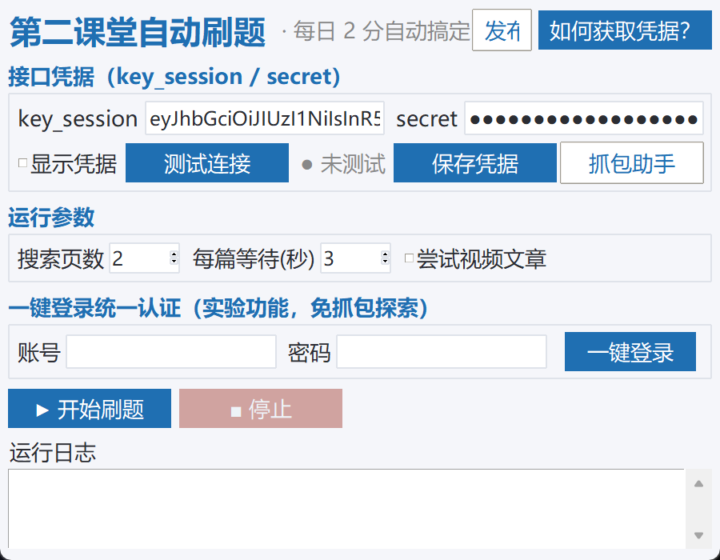
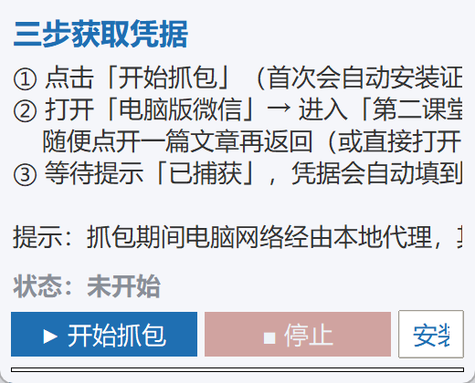
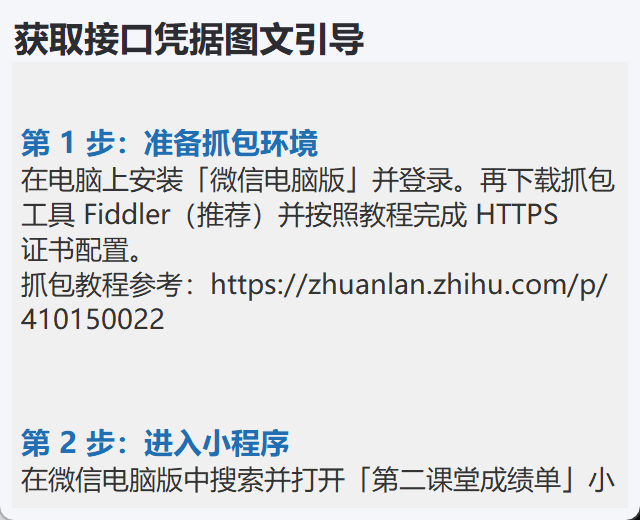

# 第二课堂自动刷题（SecondClass）

> 合肥工业大学「第二课堂」小程序 · 网络学习模块 · 自动刷题桌面软件
> 双击运行 → 自动获取凭据 → 一键开始，每天 2 分自动搞定。




## 特性

- **图形界面**：凭据填写、即时测试、一键开始，全程可视化；
- **内置抓包助手**：自动配置代理、自动从流量中捕获 `key_session`/`secret`、自动还原设置 —— 无需手动配置 Fiddler；
- **答案缓存**：答对的题记录正确答案，下次运行同一文章直接提交秒过；
- **可靠健壮**：超时自动重试、异常分类可读、单篇失败不中断整轮；
- **结果汇总**：完成篇数、答题数、未完成清单一目了然；
- **每日封顶**：识别学校每日 2 分上限，达标自动停止；
- **免抓包探索**：实验性统一认证自动登录（one.hfut.edu.cn）；
- **内置发布助手**：一键上传 GitHub 并创建 Release（含 exe 附件）。

## 快速开始

### 方式一：直接运行 exe（推荐）

1. 下载 `SecondClass.exe`（见 Releases 页面），双击运行（Windows 10/11，无需安装 Python）；
2. 点击 **「抓包助手」** → **「开始抓包」**（首次自动安装抓包证书；若弹 UAC 点「是」）；
3. 打开**电脑版微信** → 「第二课堂成绩单」小程序 → **网络学习** → 随便点开一篇文章；
4. 看到「✅ 凭据已捕获」后自动填入主窗口，点 **「测试连接」** 验证，再点 **「▶ 开始刷题」** 即可。

### 方式二：源码运行

```bash
pip install -r requirements.txt        # 主程序
pip install -r requirements-capture.txt # 抓包助手（可选）
python app.py
```

### 为什么需要凭据（key_session / secret）

第二课堂小程序接口要求请求头携带 `key_session` 与 `secret`（微信小程序登录后签发）。
软件通过模拟小程序请求来实现自动答题，因此需要这两个值。抓包助手会自动完成，
也可按内置教程手动用 Fiddler 抓取。

 

## 界面功能

| 区域 | 说明 |
|---|---|
| 接口凭据 | 粘贴 key_session / secret，支持显示/隐藏；「测试连接」即时校验 |
| 抓包助手 | 一键捕获凭据（自动代理 / 证书 / 提取 / 还原） |
| 运行参数 | 搜索页数、每篇等待秒数、是否尝试视频文章 |
| 一键登录（实验） | 统一认证自动登录探索（免抓包） |
| 发布助手 | git 提交 → 推送 GitHub → 打 tag → Release（含 exe） |
| 运行日志 | 实时滚动、分级着色，自动落盘 `%APPDATA%\SecondClass\logs\` |

## 一键打包 / 发布

```bat
build_exe.bat                        :: 打包单文件 exe（含版本信息）
python publisher.py                  :: 可视化发布助手（需 gh CLI 已登录）
```

## 常见问题

**Q：今天刷完了吗？**
学校每天 2 分上限，运行到「今日积分已达标」会自动停止，汇总有说明。

**Q：视频文章会处理吗？**
默认跳过；可在参数区勾选「尝试视频文章」（未完全验证，失败仅记录警告）。

**Q：凭据过期了？**
重新点「抓包助手」抓一次即可。

**Q：抓包助手报「未找到 mitmdump」？**
抓包助手需要 Python 环境：`pip install -r requirements-capture.txt`。

**Q：会收集账号信息吗？**
不会。凭据/缓存/日志仅存本机 `%APPDATA%\SecondClass\`，不上传、不入库。密码不落盘。

**Q：答案缓存是什么？**
答对题的正确答案记录在 `%APPDATA%\SecondClass\answer_cache.json`，
下次相同文章直接提交正确选项一次通过。

## 版本历史

- **v2.0.0**：桌面版重写 —— GUI、抓包助手、答案缓存、凭据校验、
  结果汇总、实验性统一认证登录、发布助手；真机验证通过（完成 2 篇/2 分）。

## 致谢与许可

接口调用协议与「遍历试错」答题思路参考了
[Zirconium233/SecondClass](https://github.com/Zirconium233/SecondClass)
（原作者未提供开源许可），本版为完全重写并致谢原作者。

[MIT License](LICENSE)

---

*仅限本人账号学习使用；请遵守学校网络与教务系统使用规范。*
